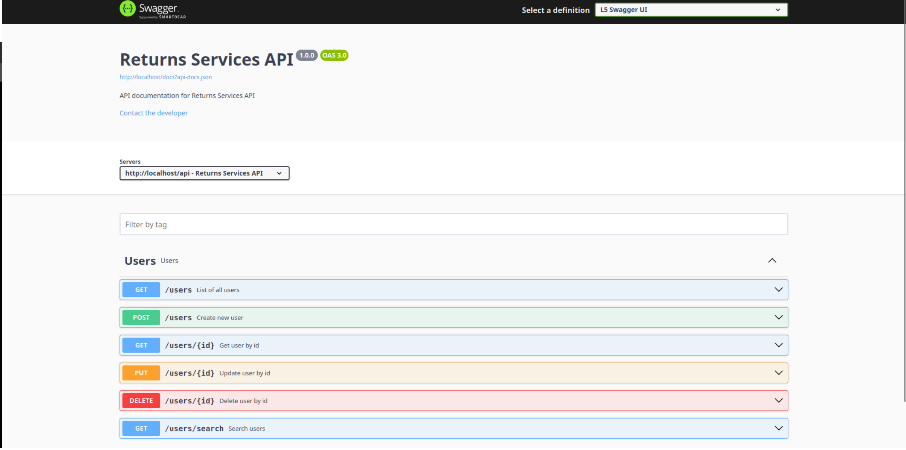

# PHP Laravel Challenge

Projeto desenvolvido para o desafio da Systock.

## 🚀 Começando

Consulte **Instalação** para saber como instalar o projeto.

### 📋 Pré-requisitos

- PHP ^8.2 ou maior;
- Laravel Framework ^12;
- Laravel Sail (Docker);
- L5 Swagger;
- PostgreSQL ^17.0;
- NodeJs ^22;
- Npm ^10.9;
- Pest PHP for Tests;
- Composer ^2.8;

### 🔧 Instalação

Dentro da pasta do projeto, rode os comandos na ordem abaixo.

```
cp .env.example .env
```

```
docker compose up -d
```

```
./vendor/bin/sail composer install
```

```
./vendor/bin/sail artisan key:generate
```

```
./vendor/bin/sail artisan migrate
```

```
npm install && npm run dev
```

## 📝 Documentação da API com Swagger

Link: [http://localhost/api/documentation](http://localhost/api/documentation)




## 🧪 Testes

Utilize este comando para executar os testes.

```
./vendor/bin/sail pest
```

## 🛠️ Construído com

- [Laravel Framework 12](https://laravel.com/) - Framework
- [Laravel Sail (Docker)](https://laravel.com/docs/12.x/sail) - Ambiente
- [Pest PHP](https://pestphp.com/docs/plugins/laravel) - Pest PHP for Tests
- [PostgreSQL](https://www.postgresql.org/) - Banco de dados

## ✒️ Autores

- **Kevin Smith** - _Desenvolvimento_ - [Kevin Smith](https://github.com/kevinsmitth)

## 📝 Licença

MIT License - Copyright (c) 2025 Kevin Smith
